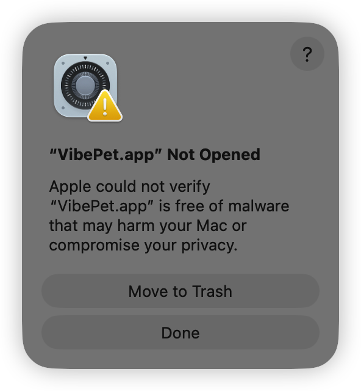
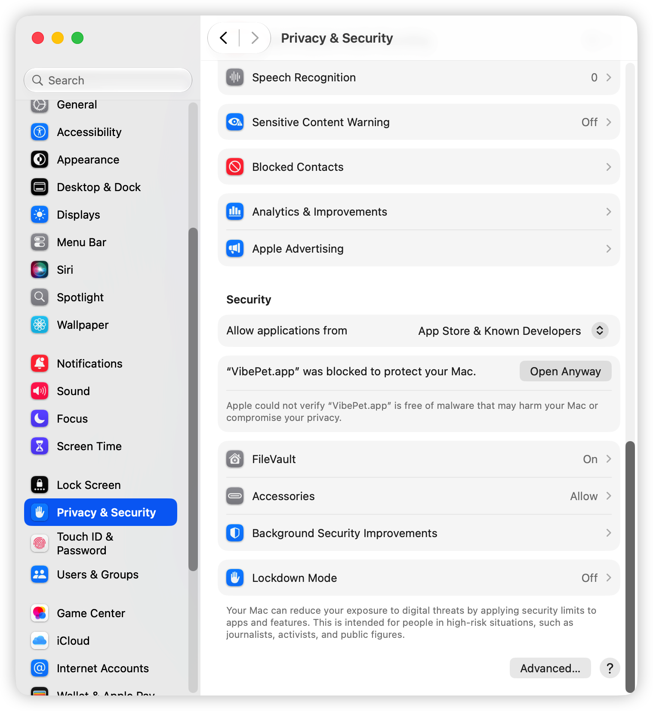

# VibePet

**English** | [简体中文](README.zh-CN.md) | [繁體中文](README.zh-TW.md)

[](https://www.apple.com/macos/)
[](https://www.swift.org/)
[](LICENSE)

**An open-source, local-first macOS desktop pet for Claude Code and Codex.**

VibePet keeps AI coding sessions visible without making you watch a terminal. The pet changes animation as agents work, surfaces approvals and questions in desktop bubbles, aggregates multiple sessions, and can jump back to the terminal that needs attention.


*Concept illustration — not a product screenshot.*

Everything runs on your Mac. VibePet does not require an account, cloud service, telemetry, or remote generation.

> [!IMPORTANT]
> VibePet is an early-stage project. GitHub binary releases are ad-hoc signed but are not signed with an Apple Developer ID or notarized by Apple, so Gatekeeper will warn on first launch. Tool hook formats and user-facing behavior may still change between releases.

## Why VibePet?

Coding agents are most useful when they can run in the background, but permission prompts and questions are easy to miss once their terminal is covered. VibePet turns those hidden waiting states into a small, persistent desktop surface:

- **See what agents are doing** — pet animations reflect running, waiting, completed, failed, and idle states.
- **Respond from the desktop** — allow, deny, or answer supported prompts directly in a bubble.
- **Track more than one session** — menu-bar counts and the session dashboard aggregate Claude Code and Codex activity across terminals.
- **Jump back to the source** — return to the originating terminal or editor when captured context is available.
- **Use Codex-format pets** — discover pets in `${CODEX_HOME:-~/.codex}/pets/` or import a local folder/ZIP package.

## Supported integrations

| Integration | Current support | Notes |
| --- | --- | --- |
| Claude Code | Approvals, structured questions, notifications, and session lifecycle | Desktop answers to `AskUserQuestion` require Claude Code 2.1.85 or newer. Known Claude Code regressions may still show the native prompt; VibePet falls back rather than blocking. |
| Codex | Approvals, turn-completion notifications, and partial session lifecycle | Codex may require trusting the installed hook through `/hooks`. Questions that cannot be answered through the hook API fall back to the terminal. |

Terminal jump-back has dedicated handling for **Apple Terminal, iTerm2, Ghostty, cmux, and VS Code**, with a safer app/working-directory fallback when an exact session cannot be resolved.

VibePet currently targets Claude Code and Codex only. Support for Cursor, Gemini, Windows, and Linux is not part of the current scope.

## Requirements

- macOS 14 or newer
- The universal GitHub release, or Xcode/an Apple Swift toolchain with Swift 6 support for source builds
- Claude Code and/or Codex for agent integration
- A Codex-format pet package (`pet.json` plus its spritesheet), either in the shared Codex pet directory or imported locally

The release does not include a bundled pet; choose an existing Codex-format pet or import one during onboarding.

## Download and install

1. Download `VibePet-v<version>-macos-universal.zip` and `SHA256SUMS` from the [latest GitHub Release](https://github.com/caichuanwang/VibePet/releases/latest).
2. Verify the archive checksum before bypassing Gatekeeper:

   ```sh
   cd ~/Downloads
   shasum -a 256 VibePet-v*-macos-universal.zip
   cat SHA256SUMS
   ```

   The hash printed for the ZIP must exactly match the corresponding entry in `SHA256SUMS`.
3. Unzip the archive and drag `VibePet.app` into `/Applications`.
4. Open VibePet. Because the release is not Apple-notarized, follow one of the methods below if macOS blocks it.

### If macOS reports an unidentified developer or quarantine

Only bypass Gatekeeper for an archive downloaded from this repository's official Releases page whose SHA-256 checksum matches.

**Method 1: System Settings (recommended)**

1. Try to open VibePet once and dismiss the warning.

   <p align="center">
     <a href="imgs/gatekeeper-blocked.png"></a>
   </p>

   *Dismiss this warning after the first launch attempt.*

2. Open **System Settings → Privacy & Security**.
3. Find the VibePet warning and click **Open Anyway**, then confirm **Open**.

   <p align="center">
     <a href="imgs/gatekeeper-open-anyway.png"></a>
   </p>

   *The **Open Anyway** button appears after macOS blocks the first launch attempt.*

**Method 2: Terminal**

Remove the quarantine attribute only from the installed VibePet app, then launch it:

```sh
xattr -dr com.apple.quarantine /Applications/VibePet.app
open /Applications/VibePet.app
```

If the first command reports a permission error, run that command once with `sudo`. Do not use this command on apps from untrusted sources.

### Get a pet for your first run

If Codex has already installed pets under `${CODEX_HOME:-~/.codex}/pets/`, VibePet discovers them automatically. You can also create a compatible pet with OpenAI's curated [`hatch-pet` skill](https://github.com/openai/skills/tree/main/skills/.curated/hatch-pet) or try a pet from the third-party [Awesome Codex Pets](https://github.com/gennadi-kuzmin/awesome-codex-pets) collection.

For example:

```sh
git clone --depth 1 https://github.com/gennadi-kuzmin/awesome-codex-pets.git /tmp/awesome-codex-pets
mkdir -p "${CODEX_HOME:-$HOME/.codex}/pets"
cp -R /tmp/awesome-codex-pets/pets/terminal-ghost "${CODEX_HOME:-$HOME/.codex}/pets/"
```

Community pets are separate projects; review their source and license before installing them.

## Build and run from source

Clone and build all targets:

```sh
git clone https://github.com/caichuanwang/VibePet.git
cd VibePet
swift build
```

Launch the app:

```sh
swift run VibePetApp
```

On first launch, onboarding lets you:

1. choose a pet already available under `${CODEX_HOME:-~/.codex}/pets/`;
2. import a Codex-format pet folder or ZIP file; and
3. install VibePet hooks for detected Claude Code and Codex installations.

Imported pets are copied to:

```text
~/Library/Application Support/VibePet/pets/
```

After onboarding, keep VibePet running while you use Claude Code or Codex. Open the menu-bar item to see active/attention counts or manage pet visibility, pet switching, import, and settings. Click the desktop pet to open the session dashboard.

### Install hooks from the CLI

The app can manage hooks through onboarding and Settings. The setup CLI provides the same core operations for source builds:

```sh
swift run VibePetSetup install all
swift run VibePetSetup status
swift run VibePetSetup doctor
```

Install only one integration when needed:

```sh
swift run VibePetSetup install claude
swift run VibePetSetup install codex
```

For `install all`, an integration is changed automatically only when its primary configuration file already exists. Use an explicit `install claude` or `install codex` command when you want to install it regardless.

The installer copies `VibePetHooks` to the stable location below instead of leaving tool configuration pointed into `.build/`:

```text
~/Library/Application Support/VibePet/bin/VibePetHooks
```

It manages only VibePet-owned entries in Claude Code and Codex configuration, records installation state in a manifest, and preserves unrelated user hooks. After installing Codex integration, open `/hooks` in Codex if trust confirmation is requested.

### Diagnose or uninstall hooks

Check installation drift without changing configuration:

```sh
swift run VibePetSetup doctor
```

Remove VibePet-managed hook entries while preserving unrelated configuration:

```sh
swift run VibePetSetup uninstall all
```

You can also uninstall one integration with `uninstall claude` or `uninstall codex`.

## Pet package format

VibePet uses the Codex spritesheet pet format:

```text
my-pet/
├── pet.json
└── spritesheet.webp
```

The atlas must be exactly **1536 × 1872 pixels**: 8 columns × 9 rows, with each frame occupying a **192 × 208 pixel** cell. Transparent PNG and WebP spritesheets are supported when referenced by the manifest.

A minimal `pet.json` is:

```json
{
  "id": "my-pet",
  "displayName": "My Pet",
  "description": "A tiny coding companion.",
  "spritesheetPath": "spritesheet.webp"
}
```

`id`, `displayName`, and `spritesheetPath` are required; `description` is optional. The spritesheet path must stay inside the pet folder. VibePet currently derives its runtime slug from the folder name—or the ZIP filename for a root-level imported package—so choose that name carefully when replacing or overriding a pet.

Pet sources are combined as follows:

- **Shared Codex library:** `${CODEX_HOME:-~/.codex}/pets/` is read in place.
- **VibePet imports:** folders and ZIP packages selected through onboarding or the menu are validated and copied into VibePet application support.
- If an imported pet and a shared pet use the same slug, the imported copy takes precedence.

VibePet does not download pets or provide an in-app online gallery.

## Privacy and safety

VibePet is designed around two non-negotiable boundaries.

### Local-first

Bridge traffic uses a local Unix domain socket. Pet discovery, hook handling, session state, configuration, and rendering stay on the Mac. The project does not add:

- accounts or cloud sync;
- telemetry or analytics uploads;
- remote pet generation;
- prompt/session uploads; or
- an online pet marketplace.

### Fail-open

Agent integrations must not depend on VibePet being healthy. If the app is not running, the socket cannot connect, input is malformed, or a decision times out, the hook defers to the coding tool's native flow instead of hanging the agent.

Please treat any regression in native fallback behavior as a high-priority bug.

## Local data and reset

VibePet keeps its managed state under:

```text
~/Library/Application Support/VibePet/
```

This includes app configuration, imported pets, the bridge socket, the stable hook helper, and the install manifest/backups. The shared Codex pet library under `${CODEX_HOME:-~/.codex}/pets/` is external data and is not part of VibePet's application state.

To return VibePet to a first-launch state:

1. Quit VibePet.
2. Run `swift run VibePetSetup uninstall all` so managed hook entries are removed safely.
3. Confirm uninstall succeeded, then delete `~/Library/Application Support/VibePet/`.
4. Launch VibePet again.

If the install manifest is missing or damaged, do **not** trust an `uninstalled` CLI message or delete application support first—the CLI may have had no managed record to remove. Manually remove only hook entries that reference `~/Library/Application Support/VibePet/bin/VibePetHooks` from `~/.claude/settings.json` and `${CODEX_HOME:-~/.codex}/hooks.json`; Codex-managed groups may also carry `statusMessage: "Managed by VibePet"`. Remove VibePet-managed Codex feature flags only when no other Codex hooks remain.

Do not delete all of `~/.claude/` or `~/.codex/`; those directories may contain unrelated user configuration and pets.

## Architecture


The Swift package is split into four products:

```text
VibePetCore/    UI-independent models, adapters, bridge, installer, persistence, and pet logic
VibePetApp/     SwiftUI/AppKit desktop app, pet window, bubbles, dashboard, settings, and bridge host
VibePetHooks/   Small fail-open hook CLI used by Claude Code and Codex
VibePetSetup/   Install, uninstall, status, and diagnostics CLI
Tests/          Core, app, setup, and end-to-end XCTest suites
docs/           Product requirements, current design specs, and archived design history
```

For the complete product and technical rationale, see the [PRD](docs/VibePet-PRD.md).

## Development

Build the package:

```sh
swift build
```

Run the full test suite:

```sh
swift test
```

Confirm package products and target membership:

```sh
swift package describe --type json
```

Installer and configuration-writer behavior must be tested with temporary files and unit tests. Do not use real install smoke tests in automated development workflows because the tool configuration paths resolve to the real `~/.claude` and `~/.codex` locations even when `$HOME` is overridden.

## Contributing

Contributions, bug reports, and focused feature proposals are welcome.

- Read the [issue guide](.github/ISSUE_GUIDE.md) before opening a report.
- Use the [Issue chooser](https://github.com/caichuanwang/VibePet/issues/new/choose) for bugs and feature requests.
- For larger changes, read the relevant documents in [`docs/superpowers/specs/`](docs/superpowers/specs/) and discuss scope before implementation.
- Keep changes small, preserve the local-first and fail-open boundaries, and add focused XCTest coverage where behavior changes.
- Submit changes through a pull request; `master` is protected from direct pushes.

The [PRD](docs/VibePet-PRD.md) and current [design specs](docs/superpowers/specs/) are optional technical context for contributors working on larger behavior changes. `AGENTS.md` contains maintainer and coding-agent workflow constraints; it is not required reading for a first contribution.

### Security reports

Do not publish exploit details, credentials, private prompts, or session content in a public issue. The repository does not currently expose a dedicated private vulnerability-reporting channel. If no private maintainer contact is available, open only a minimal issue asking how to report securely, without including vulnerability details.

## Project scope

VibePet intentionally remains focused:

- macOS 14+ only;
- Claude Code and Codex only;
- local pet packages rather than an online gallery;
- 2D spritesheet pets rather than 3D or LLM-driven characters; and
- source builds and project releases rather than a committed Mac App Store distribution path.

These boundaries can change through explicit product discussion, but they should not be weakened incidentally by implementation work.

## Acknowledgements

VibePet is inspired by [open-vibe-island](https://github.com/Octane0411/open-vibe-island) by Octane0411 and its contributors. Its target boundaries, normalized hook/session models, Unix-socket bridge, installer patterns, and terminal jump-back approach informed VibePet's architecture. VibePet adapts those ideas to a local desktop pet focused on Claude Code, Codex, and the Codex pet ecosystem.

## License

VibePet is free and open-source software licensed under the [GNU General Public License v3.0](LICENSE).
