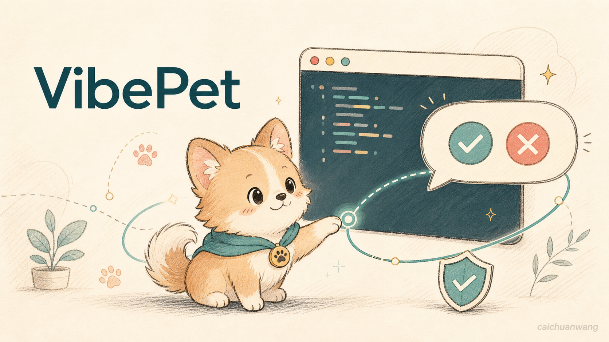
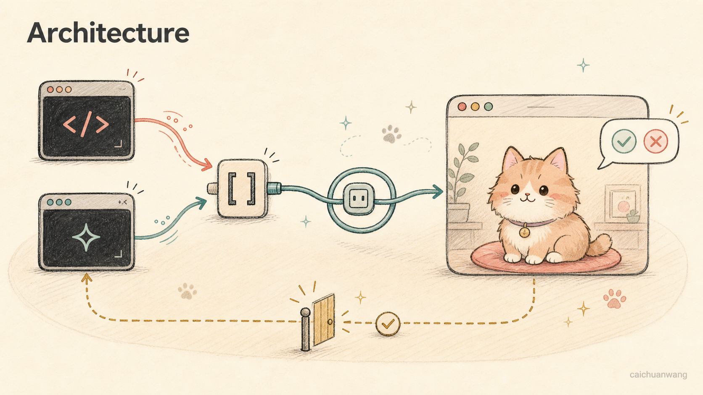

# VibePet

[English](README.md) | [简体中文](README.zh-CN.md) | **繁體中文**

[](https://www.apple.com/macos/)
[](https://www.swift.org/)
[](LICENSE)

**一個面向 Claude Code 和 Codex 的開源、本機優先 macOS 桌面寵物。**

VibePet 讓 AI 程式設計工作階段保持可見，不需要你一直盯著終端機。Agent 工作時，寵物會切換動畫；需要核准或回答問題時，它會在桌面泡泡中提醒你；它還能彙整多個工作階段，並跳回需要你處理的終端機。



*概念圖，並非產品截圖。*

一切都在你的 Mac 上執行。VibePet 不需要帳號、雲端服務、遙測或遠端生成服務。

> [!IMPORTANT]
> VibePet 仍處於早期階段，目前以原始碼建置為主，尚未發布可直接下載的二進位版本。請使用 Swift Package Manager 建置。工具的 Hook 格式和使用者可見行為仍可能隨提交而變更。

## 為什麼選擇 VibePet？

程式設計 Agent 最適合在背景執行，但當終端機被其他視窗遮住後，權限要求和問題很容易被錯過。VibePet 將這些隱藏的等待狀態轉化為一個小巧、常駐的桌面介面：

- **瞭解 Agent 正在做什麼**：寵物動畫會反映執行中、等待回應、已完成、失敗和閒置等狀態。
- **直接在桌面回應**：在泡泡中允許、拒絕或回答支援的要求。
- **追蹤多個工作階段**：功能表列計數和工作階段儀表板會彙整不同終端機中的 Claude Code 與 Codex 活動。
- **跳回工作階段來源**：如果已擷取上下文，可以返回發出要求的終端機或編輯器。
- **使用 Codex 格式寵物**：探索 `${CODEX_HOME:-~/.codex}/pets/` 中的寵物，或匯入本機資料夾、ZIP 套件。

## 支援的整合

| 整合 | 目前支援 | 說明 |
| --- | --- | --- |
| Claude Code | 核准、結構化問題、通知和工作階段生命週期 | 在桌面回答 `AskUserQuestion` 需要 Claude Code 2.1.85 或更新版本。已知的 Claude Code 迴歸問題可能仍會顯示原生提示；VibePet 會回退到原生流程，而不會阻塞 Agent。 |
| Codex | 核准、回合完成通知和部分工作階段生命週期 | Codex 可能要求透過 `/hooks` 信任已安裝的 Hook。無法透過 Hook API 回答的問題會回退到終端機。 |

終端機跳轉特別支援 **Apple Terminal、iTerm2、Ghostty、cmux 和 VS Code**。無法精確定位工作階段時，會安全地回退到對應的應用程式和工作目錄。

VibePet 目前只面向 Claude Code 和 Codex。Cursor、Gemini、Windows 和 Linux 不在目前範圍內。

## 系統需求

- macOS 14 或更新版本
- Xcode，或支援 Swift 6 的 Apple Swift 工具鏈
- 用於 Agent 整合的 Claude Code 和／或 Codex
- 一個 Codex 格式的寵物套件（`pet.json` 及其 spritesheet），可以來自共用 Codex 寵物目錄，也可以從本機匯入

儲存庫目前不包含內建寵物或預先建置的 `.app` 版本。

### 為首次執行準備寵物

如果 Codex 已在 `${CODEX_HOME:-~/.codex}/pets/` 中安裝寵物，VibePet 會自動探索它們。你也可以使用 OpenAI 精選的 [`hatch-pet` skill](https://github.com/openai/skills/tree/main/skills/.curated/hatch-pet) 建立相容寵物，或嘗試第三方 [Awesome Codex Pets](https://github.com/gennadi-kuzmin/awesome-codex-pets) 合集中的寵物。

例如：

```sh
git clone --depth 1 https://github.com/gennadi-kuzmin/awesome-codex-pets.git /tmp/awesome-codex-pets
mkdir -p "${CODEX_HOME:-$HOME/.codex}/pets"
cp -R /tmp/awesome-codex-pets/pets/terminal-ghost "${CODEX_HOME:-$HOME/.codex}/pets/"
```

社群寵物是獨立專案；安裝前請檢查其原始碼和授權條款。

## 從原始碼建置並執行

複製儲存庫並建置所有目標：

```sh
git clone https://github.com/caichuanwang/VibePet.git
cd VibePet
swift build
```

啟動應用程式：

```sh
swift run VibePetApp
```

首次啟動時，引導流程會協助你：

1. 選擇 `${CODEX_HOME:-~/.codex}/pets/` 中已有的寵物；
2. 匯入 Codex 格式的寵物資料夾或 ZIP 檔案；
3. 為偵測到的 Claude Code 和 Codex 安裝 VibePet Hook。

匯入的寵物會複製到：

```text
~/Library/Application Support/VibePet/pets/
```

完成引導後，使用 Claude Code 或 Codex 時請保持 VibePet 執行。開啟功能表列項目即可查看活動數和待處理數，也可以管理寵物顯示、切換、匯入和設定。按一下桌面寵物可開啟工作階段儀表板。

### 透過 CLI 安裝 Hook

應用程式可以透過首次啟動引導和「設定」管理 Hook。對於原始碼建置，Setup CLI 提供相同的核心操作：

```sh
swift run VibePetSetup install all
swift run VibePetSetup status
swift run VibePetSetup doctor
```

需要時也可以只安裝一個整合：

```sh
swift run VibePetSetup install claude
swift run VibePetSetup install codex
```

執行 `install all` 時，只有已存在主要設定檔的整合才會自動修改。如果希望無論設定檔是否存在都安裝某個整合，請明確執行 `install claude` 或 `install codex`。

安裝程式會將 `VibePetHooks` 複製到以下穩定位置，而不會讓工具設定指向 `.build/`：

```text
~/Library/Application Support/VibePet/bin/VibePetHooks
```

安裝程式只管理 VibePet 自己的 Claude Code 和 Codex 設定項目，會將安裝狀態記錄到資訊清單中，並保留無關的使用者 Hook。安裝 Codex 整合後，如果 Codex 要求確認信任，請在 Codex 中開啟 `/hooks`。

### 診斷或解除安裝 Hook

在不修改設定的情況下檢查安裝是否發生漂移：

```sh
swift run VibePetSetup doctor
```

移除 VibePet 管理的 Hook，同時保留無關設定：

```sh
swift run VibePetSetup uninstall all
```

也可以使用 `uninstall claude` 或 `uninstall codex` 個別解除安裝整合。

## 寵物套件格式

VibePet 使用 Codex spritesheet 寵物格式：

```text
my-pet/
├── pet.json
└── spritesheet.webp
```

圖集尺寸必須嚴格為 **1536 × 1872 像素**：8 欄 × 9 列，每個影格占用一個 **192 × 208 像素**的儲存格。資訊清單引用的 spritesheet 支援透明 PNG 和 WebP 格式。

最小的 `pet.json` 如下：

```json
{
  "id": "my-pet",
  "displayName": "My Pet",
  "description": "A tiny coding companion.",
  "spritesheetPath": "spritesheet.webp"
}
```

`id`、`displayName` 和 `spritesheetPath` 為必填欄位，`description` 選填。spritesheet 路徑必須位於寵物資料夾內。VibePet 目前依照資料夾名稱產生執行階段 slug；對於根目錄直接包含寵物檔案的 ZIP 套件，則依照 ZIP 檔名產生。因此，替換或覆寫寵物時請謹慎選擇名稱。

寵物來源按以下方式合併：

- **共用 Codex 寵物庫：**直接讀取 `${CODEX_HOME:-~/.codex}/pets/`，不會複製檔案。
- **VibePet 匯入：**透過首次啟動引導或功能表選擇的資料夾、ZIP 套件會先經過驗證，再複製到 VibePet Application Support 目錄。
- 如果匯入寵物與共用寵物使用相同的 slug，匯入版本優先。

VibePet 不會下載寵物，也不提供應用程式內的線上寵物圖庫。

## 隱私與安全性

VibePet 圍繞兩條不可妥協的界線設計。

### 本機優先

Bridge 通訊使用本機 Unix domain socket。寵物探索、Hook 處理、工作階段狀態、設定和算繪都保留在 Mac 上。本專案不會加入：

- 帳號或雲端同步；
- 遙測或分析資料上傳；
- 遠端寵物生成；
- Prompt 或工作階段內容上傳；
- 線上寵物市集。

### 失敗時回退

Agent 整合不能依賴 VibePet 始終正常執行。如果應用程式未執行、socket 無法連線、輸入格式錯誤或決策逾時，Hook 會交回程式設計工具的原生流程，而不會讓 Agent 停滯。

任何破壞原生回退流程的迴歸都應視為高優先級問題。

## 本機資料與重設

VibePet 將自己管理的狀態存放在：

```text
~/Library/Application Support/VibePet/
```

其中包括應用程式設定、匯入的寵物、Bridge socket、穩定的 Hook 輔助程式，以及安裝資訊清單和備份。`${CODEX_HOME:-~/.codex}/pets/` 下的共用 Codex 寵物庫屬於外部資料，不是 VibePet 應用程式狀態的一部分。

要讓 VibePet 恢復到首次啟動狀態：

1. 結束 VibePet。
2. 執行 `swift run VibePetSetup uninstall all`，安全移除由 VibePet 管理的 Hook 設定。
3. 確認解除安裝成功後，刪除 `~/Library/Application Support/VibePet/`。
4. 再次啟動 VibePet。

如果安裝資訊清單遺失或損壞，請**不要**輕信 CLI 輸出的 `uninstalled`，也不要先刪除 Application Support 目錄，因為 CLI 可能沒有找到任何受管理記錄。請只從 `~/.claude/settings.json` 和 `${CODEX_HOME:-~/.codex}/hooks.json` 中手動移除引用 `~/Library/Application Support/VibePet/bin/VibePetHooks` 的 Hook；由 VibePet 管理的 Codex Hook 群組也可能包含 `statusMessage: "Managed by VibePet"`。只有在沒有其他 Codex Hook 時，才移除 VibePet 管理的 Codex 功能旗標。

不要刪除整個 `~/.claude/` 或 `~/.codex/`，這些目錄中可能包含無關的使用者設定和寵物。

## 架構



Swift 套件分為四個產品：

```text
VibePetCore/    與 UI 無關的模型、轉接器、Bridge、安裝程式、持久化和寵物邏輯
VibePetApp/     SwiftUI/AppKit 桌面應用程式、寵物視窗、泡泡、工作階段儀表板、設定和 Bridge Host
VibePetHooks/   Claude Code 和 Codex 使用的小型失敗回退 Hook CLI
VibePetSetup/   安裝、解除安裝、狀態和診斷 CLI
Tests/          Core、App、Setup 和端對端 XCTest 測試
docs/           產品需求、目前設計規格和歷史設計封存
```

完整的產品與技術決策說明請參閱 [PRD](docs/VibePet-PRD.md)。

## 開發

建置套件：

```sh
swift build
```

執行完整測試套件：

```sh
swift test
```

確認套件產品和建置目標歸屬：

```sh
swift package describe --type json
```

安裝程式和設定寫入邏輯必須使用暫存檔進行單元測試。自動化開發流程中不要執行真實安裝冒煙測試，因為即使覆寫 `$HOME`，工具設定路徑仍會解析到真實的 `~/.claude` 和 `~/.codex` 位置。

## 參與貢獻

歡迎提交貢獻、問題報告和範圍明確的功能提案。

- 提交報告前，請閱讀 [Issue 指南](.github/ISSUE_GUIDE.md)。
- 使用 [Issue 選擇器](https://github.com/caichuanwang/VibePet/issues/new/choose)提交問題或功能要求。
- 對於較大的變更，請閱讀 [`docs/superpowers/specs/`](docs/superpowers/specs/) 中的相關文件，並先討論範圍。
- 保持變更精簡，維護本機優先和失敗回退界線，並在行為發生變化時加入針對性的 XCTest 涵蓋。
- 透過 Pull Request 提交變更；`master` 分支受到保護，不能直接推送。

對於參與較大行為變更的貢獻者，[PRD](docs/VibePet-PRD.md) 和目前的[設計規格](docs/superpowers/specs/)可作為選用的技術背景。`AGENTS.md` 包含維護者和程式設計 Agent 的工作流程限制，首次貢獻不需要閱讀。

### 安全性問題回報

不要在公開 Issue 中發布漏洞細節、憑證、私有 Prompt 或工作階段內容。儲存庫目前沒有專用的私密漏洞回報管道。如果找不到維護者的私密聯絡方式，請只建立一個不含漏洞細節的最小 Issue，詢問應該如何安全回報。

## 專案範圍

VibePet 有意保持專注：

- 僅支援 macOS 14+；
- 僅支援 Claude Code 和 Codex；
- 使用本機寵物套件，不提供線上圖庫；
- 使用 2D spritesheet 寵物，不使用 3D 或 LLM 驅動的角色；
- 以原始碼建置和專案發行版本為主，不將 Mac App Store 視為已確定的發布管道。

這些界線可以透過明確的產品討論而變更，但不應在實作過程中被無意削弱。

## 致謝

VibePet 的靈感來自 Octane0411 及其貢獻者開發的 [open-vibe-island](https://github.com/Octane0411/open-vibe-island)。它的模組界線、標準化 Hook／工作階段模型、Unix socket 橋接、安裝程式模式和終端機跳轉方案影響了 VibePet 的架構。VibePet 將這些思路調整為一個本機桌面寵物，專注於 Claude Code、Codex 和 Codex 寵物生態系。

## 授權條款

VibePet 是依據 [GNU General Public License v3.0](LICENSE) 授權的自由開源軟體。
